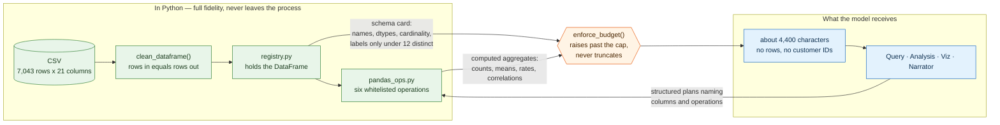
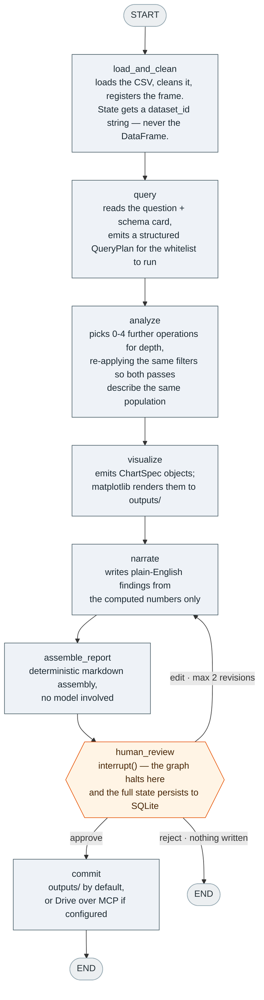

<div align="center">

# agentic-analyst

**Ask a plain-English question about a CSV. Get a reviewed analyst's report back.**

A LangGraph pipeline of four agents interprets the question, computes the statistics in
pandas, draws the charts, and writes the findings — then stops and waits for you to
approve, revise, or reject before anything is published.

[](https://agentic-analyst-wrmbokujnbr5huunnvenih.streamlit.app/)
[](https://www.python.org/)
[](https://langchain-ai.github.io/langgraph/)
[](https://modelcontextprotocol.io/)
[](#verifying-the-claims)

**[▶ Try it live](https://agentic-analyst-wrmbokujnbr5huunnvenih.streamlit.app/)**

</div>

---

```console
$ uv run python run.py "Which contract type has the highest churn rate?"

Monthly    42.71% churn   (n=3,875)
One year   11.27% churn   (n=1,473)
Two year    2.83% churn   (n=1,695)
```

<!-- Demo gif goes here. The shot worth capturing is the kill-and-resume: run to the
     review gate, kill the terminal, then resume from the SQLite checkpoint in a fresh
     one.   -->

---

## Contents

- [Why it's built this way](#why-its-built-this-way)
- [Architecture](#architecture)
- [Setup](#setup)
- [Running it](#running-it)
- [Bring your own CSV](#bring-your-own-csv)
- [Observability](#observability)
- [Tech stack](#tech-stack)
- [Layout](#layout)

---

## Why it's built this way

Four agents is not the interesting part. The interesting part is four constraints I set
before writing any code, each of which shaped the architecture.

### 1 · No raw data ever reaches an LLM

The obvious way to build "chat with your data" is to paste rows into the prompt. That
breaks immediately: you burn the context window on any real dataset, you pay per row on
every question, and you're asking a language model to do arithmetic.

So every number here is computed in pandas. The models decide *what* to compute and
interpret what comes back — **they never see a row.**

I enforced this structurally rather than by prompt discipline:

| Mechanism | What it does |
|---|---|
| `data/registry.py` | The DataFrame never enters graph state. State carries a `dataset_id` string; the frame lives in an in-process registry. A model can't leak what was never put in front of it. |
| Schema card | Agents get column names, dtypes, null counts, cardinality — and distinct labels *only* for low-cardinality categoricals. Columns above 12 distinct values are classed as identifiers, so no customer ID is ever in a prompt. |
| `enforce_budget()` | Gates every model-bound payload and **raises** past the cap rather than truncating. A guardrail that quietly trims is one you discover in the bill. |



The arrows into the model only ever carry metadata and aggregates. There is no edge on
this diagram that a row could travel down.

The payoff is measurable:

```text
  7,043 rows  →  4,397 characters of prompt
 14,086 rows  →  4,398 characters of prompt
                 ────────────────────────────
                 0.02% change from doubling the data
```

Token cost is flat in dataset size. `verify.py` proves it rather than asserting it.

### 2 · The dirty data is handled on purpose

`TotalCharges` in the bundled dataset is stored as text, and 11 rows contain a single
space.

They are **not** `NaN` — `isna()` reports zero nulls across the entire frame, so a naive
missing-value check finds nothing at all. That's the trap, and a plain
`to_numeric(errors="coerce").dropna()` would silently delete those rows and skew every
downstream statistic.

I profiled them instead of guessing. All 11 have `Tenure = 0`: brand-new customers who
haven't been billed a cycle yet. So `0.0` is the **accurate** value, not an imputation.
The cleaning step:

- coerces them and flags them with `is_new_customer`
- records all 11 customer IDs in the report that ships with the analysis
- asserts row count in equals row count out — **nothing is ever dropped**
- re-checks the `Tenure == 0` assumption on every run, downgrading to a loud warning if
  it stops holding, rather than trusting a profile I did once

One more thing I found by profiling: this is a **modified** Telco export, not the
canonical Kaggle file. Columns are TitleCase (`Gender`, `Tenure`), `Contract` uses
`Monthly` rather than `Month-to-month`, and `PaymentMethod` collapses the two check
types into `Manual`. Code copied from a standard Telco tutorial breaks on it. So there
are no hardcoded column names in the analysis path, and the loader asserts the expected
schema at load time rather than producing quietly wrong numbers.

### 3 · The human gate is a real interrupt, not an `input()`

`human_review` calls LangGraph's `interrupt()`, and the graph genuinely halts with state
persisted to SQLite keyed by `thread_id`.

I used `SqliteSaver` rather than `InMemorySaver` deliberately. In-memory would
technically satisfy "uses `interrupt()`", but the pause would only survive inside one
process — which makes it a glorified function call. With SQLite I can kill the process
at the review gate and resume in a brand new interpreter.

That's the difference between demonstrating the pattern and just naming it. A useful side
effect: **both front ends share one checkpoint database**, so a run started in the browser
can be resumed from the terminal.

### 4 · Model output never becomes executable code

The other obvious approach is to have the LLM write pandas code and `exec()` it. I
rejected that outright — arbitrary code execution driven by model output, failing in ways
you can't catch.

Instead the agents emit Pydantic objects (`QueryPlan`, `AnalysisPlan`, `VizPlan`) with
strict JSON-schema decoding enforced server-side, and a whitelist of six pandas
operations executes them:

```text
value_counts · group_agg · describe · correlate · detect_outliers · crosstab_rate
```

Anything outside the whitelist is rejected before touching pandas. The worst a bad plan
can do is name a column that doesn't exist and get a clean error back. The same principle
covers charts: the viz agent emits a declarative `ChartSpec` and matplotlib renders it.
The model describes the chart; it never draws it.

### 5 · The sink is pluggable, and ships on local storage

Report output sits behind a `ReportSink` ABC with two implementations.

**`LocalReportSink`** is the default and always works: on approval, `report.md` and the
chart PNGs land in a timestamped folder under `outputs/`. A fresh clone runs end to end
with nothing but an OpenAI key.

**`DriveMCPSink`** is implemented and stays in the codebase as the optional path. I'll be
straight about why it isn't the default: **both Google Drive MCP servers I evaluated
turned out to be read-only.** `@modelcontextprotocol/server-gdrive` was archived in
January 2025 and exposes only search and read; the alternative I tried was read-only in
practice too. Neither has a create or upload tool, so neither can fulfil the sink's write
contract.

Rather than hardcode a tool name, the sink discovers the server's tools at runtime and
matches a create/upload tool by pattern. If it can't find one — or the server isn't
configured, or the connection fails — it logs the reason and falls back to local, and the
run still succeeds. That's the value of the abstraction: pointing this at a write-capable
server is a `.env` change, not a code change.

---

## Architecture



The gate is the only node that stops. Everything above it is a straight line; everything
below it depends on what a person decided.

### The agents

| Agent | Model | Job |
|:--|:--|:--|
| **Query** | `gpt-5.4-mini` · structured, temp 0 | Turns the question + schema into a plan of filters and operations |
| **Analysis** | `gpt-5.4-mini` · structured, temp 0 | Picks further computations for statistical depth |
| **Viz** | `gpt-5.4-mini` · structured, temp 0 | Chooses charts declaratively |
| **Narrator** | `openai/gpt-oss-120b` on Groq · prose | Writes the findings from the computed numbers |

Every model is overridable per agent via `.env` using `provider:model` syntax, and they
are instantiated directly (`ChatOpenAI` / `ChatGroq`) rather than through
`init_chat_model` — the per-provider kwargs differ enough that the indirection costs more
than it saves.

The narrator is on a different provider deliberately. gpt-oss models tend to leak
reasoning fragments into tool-call slots, so I keep them away from anything the graph
has to parse. The narrator emits pure prose — no tool calls, no schema — which means
that failure mode has nowhere to land, and I get Groq's speed where it's safe. If
`GROQ_API_KEY` isn't set, the narrator falls back to the OpenAI model and everything
still runs.

---

## Setup

Requires **Python 3.13** and [uv](https://docs.astral.sh/uv/).

```bash
git clone https://github.com/shashwatfr/agentic-analyst.git
cd agentic-analyst

uv venv
uv pip install -r requirements.txt

cp .env.example .env    # then add your keys
```

Only `OPENAI_API_KEY` is required. Groq, LangSmith, and Drive are all optional and
degrade cleanly.

---

## Running it

### Live demo

**[agentic-analyst.streamlit.app](https://agentic-analyst-wrmbokujnbr5huunnvenih.streamlit.app/)** — deployed on Streamlit Community Cloud, no install required.

Upload your own CSV or use the bundled churn dataset. The hosted instance runs on
ephemeral storage, so approved reports land in the container's `outputs/` and are cleared
when the app sleeps — clone and run locally if you want them to persist.

### Web UI

```bash
uv run streamlit run app.py
```

Upload a CSV or use the bundled one, pick a question, and watch the agents run. You land
on the review gate: charts, the draft report, and **Approve / Request changes / Reject**.
The sidebar shows the dataset shape, which cleaning rules were applied, each agent's
model, tracing status, and the current thread id.

### CLI

The same graph from a terminal — the scriptable path, and the clearest demonstration that
the pause is real.

```bash
# Ask a question. Runs to the review gate, then prompts.
uv run python run.py "Which contract type has the highest churn rate?"

# Stop at the gate without prompting; prints a thread id to resume with.
uv run python run.py "What drives churn among fiber optic customers?" --no-interaction

# Resume a paused run — in a completely new process.
uv run python run.py --resume run-8c1f6618 --decision approve

# Ask for changes instead.
uv run python run.py --resume run-8c1f6618 --decision edit \
  --feedback "Cut it to two paragraphs and lead with the dollar difference."

# Point it at any CSV.
uv run python run.py "Which plan tier churns most?" --dataset uploads/accounts.csv
```

**The kill-and-resume is the demo I care about.** Start a run, let it reach the review
gate, kill the terminal, then run the `--resume` command in a fresh shell. It reloads from
the SQLite checkpoint and commits. That only works because the pause is a genuine
`interrupt()` with state living outside the process.

### Verifying the claims

```bash
uv run python verify.py
```

**24 checks, no model calls**, so it's free and fast. It confirms the cleaning behaviour,
the schema-drift guard, arbitrary-CSV handling, that no customer ID reaches a prompt, that
prompt size is flat in dataset size, that the narrator's prose survives a cp1252
console, and that the budget guard raises rather than truncates.

---

## Bring your own CSV

Upload any CSV through the web UI, or pass `--dataset` on the CLI. Nothing is hardcoded to
the churn dataset.

Cleaning adapts to what it's given:

| Dataset | Rules applied |
|:--|:--|
| The bundled Telco file | **Hand-written rules** — the `Tenure == 0` driver check, the `is_new_customer` flag, and the 11 logged IDs. Grounded in profiling that generic inference can't reproduce. |
| Anything else | **Inferred rules** — detects the ID column, finds text columns that are mostly numeric, and coerces them. |

The distinction matters, and the report says which path it took. Inferred rules are
weaker by definition: without domain knowledge there's no basis for choosing a fill value,
so failed conversions are **left as nulls rather than filled with an invented number**.
Every inference is disclosed in the cleaning section, so a reader can see what was assumed
instead of having to trust it.

What doesn't change: row count in always equals row count out, and the schema card and
operation whitelist are built from whatever columns actually exist — so all four agents
work on any dataset without modification.

Uploads land in `uploads/`, which is gitignored so nobody's data ends up committed.

---

## Observability

Set `LANGCHAIN_API_KEY` for per-agent traces in LangSmith — token usage, latency, and
inputs/outputs for every node.

```bash
LANGCHAIN_TRACING_V2=true
LANGCHAIN_API_KEY=lsv2_...
LANGCHAIN_PROJECT=agentic-analyst
```

Built-in auto-instrumentation only; every graph node shows up as a span on its own.
Tracing is **entirely optional** — leave the key blank and the pipeline runs normally with
tracing explicitly disabled, so a stale env var can't break a fresh clone.

---

## Tech stack

| Layer | Tools |
|:--|:--|
| **Orchestration** | LangGraph — `StateGraph`, `interrupt()`, SQLite checkpointing |
| **Models** | LangChain · OpenAI `gpt-5.4-mini` · Groq `gpt-oss-120b` |
| **Integration** | MCP via `langchain-mcp-adapters` (optional Drive sink) |
| **Data** | pandas · matplotlib · seaborn |
| **Interface** | Streamlit · Rich (console) |
| **Ops** | LangSmith tracing (optional) · uv for env and dependencies |

---

## Layout

```text
app.py                        Streamlit front end
run.py                        CLI entrypoint / resume path
verify.py                     proves the claims above — 24 checks
src/agentic_analyst/
├── config.py                 env, per-agent model registry, optional tracing
├── models.py                 ChatOpenAI / ChatGroq construction
├── state.py                  graph state + the Pydantic schemas agents emit
├── graph.py                  StateGraph wiring, interrupt(), SQLite checkpointer
├── hitl.py                   console review UI
├── report.py                 markdown assembly
├── data/
│   ├── source.py             DataSource ABC  ← the SQL swap point
│   ├── csv_source.py         CSV implementation
│   ├── cleaning.py           declarative rules + inference for unknown files
│   ├── registry.py           keeps the DataFrame out of graph state
│   └── summaries.py          schema cards + the payload budget
├── tools/pandas_ops.py       the six-operation whitelist
├── agents/                   query, analysis, viz, narrator
└── sinks/                    base ABC, local (default), drive_mcp (optional)
```

---

## What's next

**SQL input.** `DataSource` is already an ABC with `CsvSource` as one implementation, and
nothing downstream knows where the rows came from — so a database source is a new subclass
rather than a rewrite. After that, streaming per-node progress to the UI instead of a
single spinner.

---

<div align="center">

**Shashwat Goswami**

[wshashwatgoswami@gmail.com](mailto:wshashwatgoswami@gmail.com) · [github.com/shashwatfr](https://github.com/shashwatfr)

</div>
