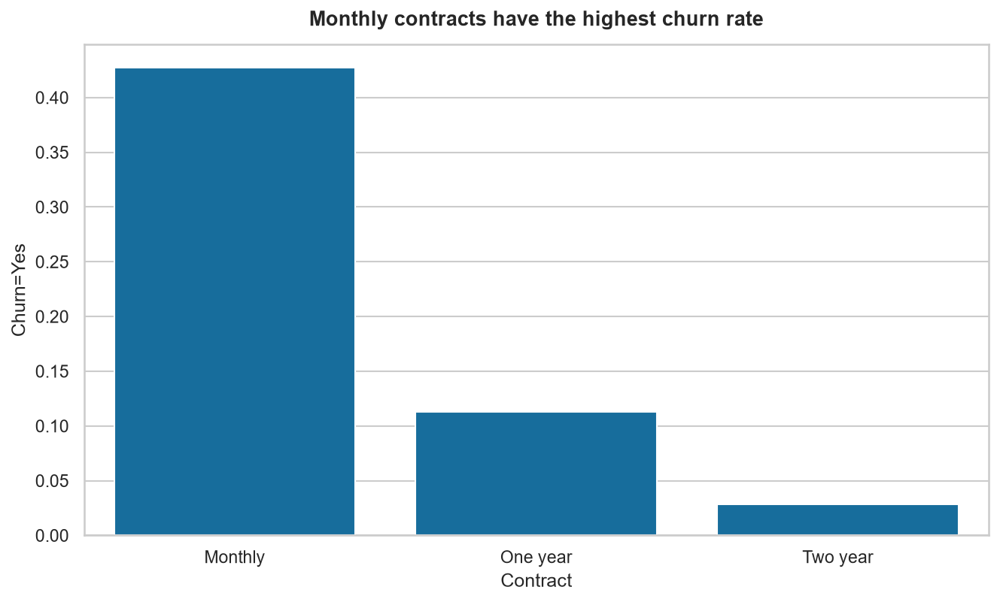

# Which contract type has the highest churn rate?

_Generated 2026-08-20 10:52_

## How the question was read

Compare churn rate across Contract values (Monthly, One year, Two year) to find which contract type has the highest rate of Churn == Yes.

Analysed **7,043** of 7,043 rows (no filters applied).

## Findings

The contract type with the highest churn rate is the Monthly contract.  

For customers on a Monthly contract, the proportion that churned (Churn = Yes) is 0.4271, compared with 0.1127 for One year contracts and 0.0283 for Two year contracts. The sample sizes are 3,875 for Monthly, 1,473 for One year, and 1,695 for Two year customers.  

Data cleaning involved coercing eleven blank TotalCharges values to zero and recoding the SeniorCitizen field, but these steps did not alter any churn outcomes or the counts used here.  

The results reflect overall churn across the full dataset of 7,043 rows; they do not account for other variables that might influence churn within each contract category.

## Charts

**Monthly contracts have the highest churn rate**

_Churn=Yes is highest for Monthly contracts, far above One year and Two year._

## Computed results

### `crosstab_rate_Contract`

| Contract | Churn=No | Churn=Yes | n |
| --- | --- | --- | --- |
| Monthly | 0.5729 | 0.4271 | 3875 |
| One year | 0.8873 | 0.1127 | 1473 |
| Two year | 0.9717 | 0.0283 | 1695 |

## Data preparation

Loaded **7,043 rows** from `TelecomCustomerChurn.csv`; **7,043 rows** after cleaning. No rows were dropped.

- **`TotalCharges`** was stored as text. 11 rows could not be converted (11 blank, 0 unparseable) and were set to zero under the `zero` strategy, flagged as `is_new_customer`.
  - Every affected row has `Tenure == 0` (confirmed), so zero is the accurate value rather than an imputation.
  - Affected IDs: `4472-LVYGI`, `3115-CZMZD`, `5709-LVOEQ`, `4367-NUYAO`, `1371-DWPAZ`, `7644-OMVMY`, `3213-VVOLG`, `2520-SGTTA`, `2923-ARZLG`, `4075-WKNIU`, `2775-SEFEE`
- **`SeniorCitizen`** recoded from ['0', '1'] to ['No', 'Yes'] for consistency with the other categorical columns.

Remaining nulls after cleaning: none.
